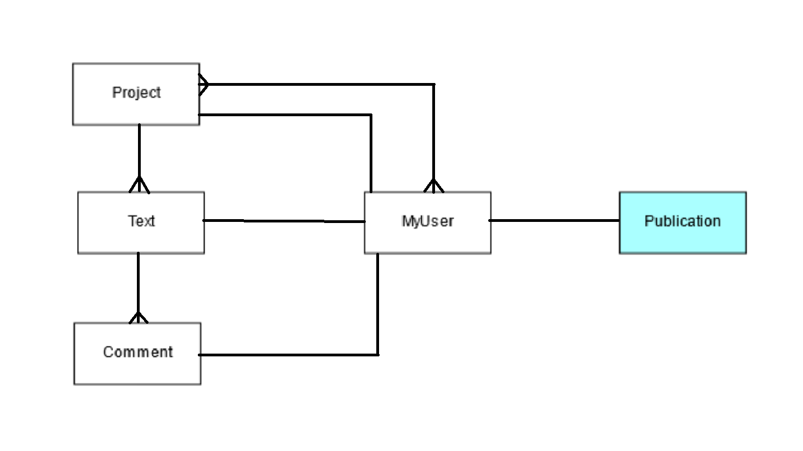

# ArticleManager
RESTful api, which goal is to enable managment and work in editorial office or team of writers. Api provides users with adding projects, texts and comments in internal part of api and ability to get made publications by customers in external. Api is built with principles of secure api like strong authentication, suitable permissions and throttling.

## Link to dockerized version on dockerhub.com
- https://hub.docker.com/repository/docker/procentaurus/article-manager/general

## Entity classes contained by the system:
- Project
- Text
- Comment
- MyUser
- Publication

## ERD schema

